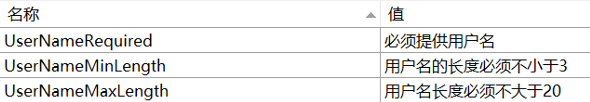

# ObservableValidator

`ObservableValidator`（以下简称为 `OV`）差不多可以说是工具包的最后一块拼图。它与 [ObservableRecipient](ObservableRecipient.md) 类似，都是 `ObservableObject` 的子类。顾名思义，`OV` 的作用旨在提供对于数据的验证。它提供了如下几个属性或方法：

- `HasErrors`：一个布尔值，表示当前的 VM 中是否有错误
- `GetErrors`：一个方法，用于获取当前 VM 中的所有错误信息
- `ValidateProperty`：一个方法，用于验证当前 VM 中的某个属性
- `ValidateAllProperties`：一个方法，用于验证当前 VM 中的所有属性

除此之外，`OV` 还支持 DOTNET 标准库中的许多用于数据验证的特性，比如：

- `Required`：表示当前属性不能为空
- `MinLength`：表示当前属性的最小长度
- `MaxLength`：表示当前属性的最大长度
- `EmailAddress`：表示当前属性必须是一个合法的邮箱地址

!!! info "这些属性位于 `System.ComponentModel.DataAnnotations` 命名空间中"

!!! note "这个类的工作原理及数据验证的理念大量借鉴于 ASP.NET Core"

## 基本用法

一个典型的包含数据验证功能的 VM，通常会对应一个表单，比如用户注册信息等。此时，VM 的代码通常形如：

```csharp
using CommunityToolkit.Mvvm.ComponentModel;
using CommunityToolkit.Mvvm.Input;
using System.ComponentModel.DataAnnotations;
using System.Diagnostics;

partial class RegisterFormViewModel : ObservableValidator
{
    [Required] // (4)!
    [MinLength(3)]
    [MaxLength(20)]
    [ObservableProperty]
    string _username = string.Empty;

    [Required]
    [EmailAddress]
    [ObservableProperty]
    string _email = string.Empty;

    [RelayCommand]
    void Submit()
    {
        ValidateAllProperties(); // (1)!

        if (HasErrors) // (2)!
        {
            Debug.WriteLine(
                string.Join(
                    Environment.NewLine,
                    GetErrors()/* (3)! */.Select(e => e.ErrorMessage)
                ));
            return;
        }

        Debug.WriteLine("Submit successfully.");
    }
}
```

1. 这个方法可以一键判断当前类中的所有需要被验证的属性
2. 这个方法可以快速判断当前类中是否存在错误信息
3. 这个方法可以获取当前类中所有的错误信息
4. 这些属性可以快速为属性添加验证规则

!!! note
    实际运行之后不难发现，对于数据的验证，只发生在调用 `ValidateAllProperties` 方法之后。这意味着，如果用户在输入框中输入了错误的数据，但是没有点击提交按钮，那么这些错误信息是不会被显示的；一旦点击了提交按钮，此时不仅会进行数据验证，还会在界面上也进行提示（比如文本框的边框会变红）。

!!! note
    如果想要实现实时验证，可以在 `setter` 中调用 `ValidateProperty` 方法，或者也可以为字段添加 `NotifyDataErrorInfo` 特性。后者是基于源生成器的，详见 [与字段相关的源生成器特性](../Source%20Generator/FieldAttributes.md#_6)。

## 自定义验证

如果 DOTNET 原生的用于数据验证的特性无法满足需求，也就是需要自定义一些更加复杂的验证方式，那么有两种方法：

### 实现一个返回值为 `ValidationResult` 类型的方法

这个方法不一定要写在当前的 VM 当中，而是可以写在别的类中，从而使其更加通用。但是这个方法与下面的比，缺乏了一定的定制能力，因为无法像特性那样通过为构造传参来进行相关的配置，所以写在 VM 当中可以一定程度上弥补这个缺陷。

```csharp
public class RegistrationForm : ObservableValidator
{
    private readonly IFancyService service;

    public RegistrationForm(IFancyService service)
    {
        this.service = service;
    }

    private string name;

    [Required]
    [MinLength(2)]
    [MaxLength(100)]
    [CustomValidation(typeof(RegistrationForm), nameof(ValidateName))]
    public string Name
    {
        get => this.name;
        set => SetProperty(ref this.name, value, true);
    }

    public static ValidationResult ValidateName(string name, ValidationContext context)
    {
        RegistrationForm instance = (RegistrationForm)context.ObjectInstance;
        bool isValid = instance.service.Validate(name);

        if (isValid)
        {
            return ValidationResult.Success;
        }

        return new("The name was not validated by the fancy service");
    }
}
```

### 实现一个继承了 `ValidationAttribute` 的类

[`ValidationAttribute`](https://source.dot.net/#System.ComponentModel.Annotations/System/ComponentModel/DataAnnotations/ValidationAttribute.cs,bf57007a2f61c388) 是一个 .NET 原生的抽象类。上面提到的一些常用的特性，比如 `Required`、`MinLength` 等，都是继承了这个类。实现一个继承了这个类的子类，就可以更加灵活地进行数据验证，因为可以通过构造函数传参来进行相关的配置。比如：

```csharp
public sealed class GreaterThanAttribute : ValidationAttribute
{
    public GreaterThanAttribute(string propertyName)
    {
        PropertyName = propertyName;
    }

    public string PropertyName { get; }

    protected override ValidationResult IsValid(object value, ValidationContext validationContext)
    {
        object
            instance = validationContext.ObjectInstance,
            otherValue = instance.GetType().GetProperty(PropertyName).GetValue(instance);

        if (((IComparable)value).CompareTo(otherValue) > 0)
        {
            return ValidationResult.Success;
        }

        return new("The current value is smaller than the other one");
    }
}
```

!!! note
    注意到 `IsValid` 方法会传入一个 `ValidationContext` 类型的参数，这个参数包含了当前的实例对象，所以可以通过这个对象来获取到当前实例对象的其他属性的值。在上面的例子中，就是通过这个上下文获取到了 VM 对象，进而使用反射获取到了另外一个属性的值，从而进行比较。

使用方法如下：

```csharp
public class ComparableModel : ObservableValidator
{
    private int a;

    [Range(10, 100)]
    [GreaterThan(nameof(B))]
    public int A
    {
        get => this.a;
        set => SetProperty(ref this.a, value, true);
    }

    private int b;

    [Range(20, 80)]
    public int B
    {
        get => this.b;
        set
        {
            SetProperty(ref this.b, value, true);
            ValidateProperty(A, nameof(A));
        }
    }
}
```

## 本地化错误消息

借助原生的特性，我们可以很轻易地获得有价值的错误信息。但是这些错误信息是英文的，而且内容或许并不适合直接展示给用户。如果需要定制错误信息，那么 `ValidationAttribute` 有一个 `ErrorMessage` 属性，可以通过这个属性来进行定制。例如：

```csharp
[Required(ErrorMessage = "The name is required")]
[MinLength(2, ErrorMessage = "The name must be at least 2 characters long")]
[MaxLength(100, ErrorMessage = "The name must be at most 100 characters long")]
public string Name
{
    get => this.name;
    set => SetProperty(ref this.name, value, true);
}
```

如果希望实现本地化，那么原生也支持借助 .resx 文件的方式对于本地化文本进行管理。

假如我们现在有一个 `Resources.resx` 文件，以及一个 `Resources.zh-CN.resx` 文件。里面分别包含了如下的内容（图中展示了一些错误信息的键值，以及在 `zh-CN` 文件中的中文翻译）：



然后我们就可以通过如下的方式来实现本地化：

```csharp
[Required(ErrorMessageResourceName = "UserNameRequired", ErrorMessageResourceType = typeof(Resources))]
[MinLength(3, ErrorMessageResourceName = "UserNameMinLength", ErrorMessageResourceType = typeof(Resources))]
[MaxLength(20, ErrorMessageResourceName = "UserNameMaxLength", ErrorMessageResourceType = typeof(Resources))]
[ObservableProperty]
string _username = string.Empty;
```

此时只要我们设置了正确的 `CultureInfo`，那么错误信息就会自动切换为对应的语言。设置方式如下：

```csharp
CultureInfo.CurrentCulture = new CultureInfo("zh-CN");
CultureInfo.CurrentUICulture = new CultureInfo("zh-CN");
```

## 使用 Avalonia UI 时需要注意的地方

Avalonia UI 对于校验功能有一套自己的 `BindingPlugins` 机制，并内置了一些 `DataValidator`，用来提供数据校验功能。具体来说，一个默认的项目会包含如下几个 `Plugin`：


可以看到，第一个插件就是 `DataAnnotationsValidationPlugin`，它会自动扫描视图模型中的数据注解特性，并进行相应的校验。

但不太妙的是，这与我们工具包的 `ObservableValidator` 的实现方式“不谋而合”，或者说重复了。因此，如果我们要在一个 Avalonia UI 项目中使用 `ObservableValidator`，就需要注意避免与内置的校验机制产生冲突。

具体做法为，我们可以将 Avalonia 自带的这个与 `DataAnnotations` 相关的插件给移除。比如，我们可以在 `App.axaml.cs` 中这样做：

```csharp
public override void OnFrameworkInitializationCompleted()
{
    if (ApplicationLifetime is IClassicDesktopStyleApplicationLifetime desktop)
    {
        DisableAvaloniaDataAnnotationValidation();
        desktop.MainWindow = new MainWindow
        {
            DataContext = new MainWindowViewModel(),
        };
    }

    base.OnFrameworkInitializationCompleted();
}

private void DisableAvaloniaDataAnnotationValidation()
{
    var dataValidationPluginsToRemove =
        BindingPlugins.DataValidators.OfType<DataAnnotationsValidationPlugin>().ToArray();
    
    foreach (var plugin in dataValidationPluginsToRemove)
    {
        BindingPlugins.DataValidators.Remove(plugin);
    }
}
```

!!! note
    简单起见，我们还可以将上面的 `DisableAvaloniaDataAnnotationValidation` 简单写成 `BindingPlugins.DataValidators.RemoveAt(0)`，因为它总是在第一个。当然这看起来可能有些“魔法”，但至少目前来说，是可行且有效的。

上面的方式其实也是使用 `Avalonia` 官方的模板搭配工具包实现 MVVM 时生成的默认代码。在安装了 Avalonia UI 相关的模板后，可以用下面的控制台指令进行创建：

```shell
dotnet new avalonia.mvvm -m CommunityToolkit
```

然后就可以在 `App.axaml.cs` 中看到上面的逻辑了。
