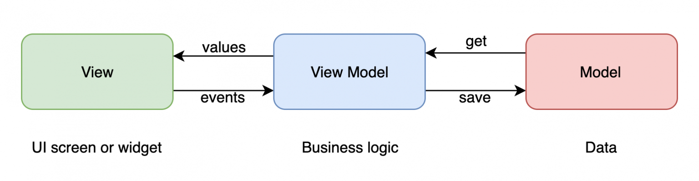

# MVVM（Model-View-ViewModel）

下面是一张经典的 MVVM 模式的示意图（[出处](https://dzone.com/articles/a-beginners-guide-to-implementing-mvvm-architectur)）：



可以看出，MVVM 模式主要由三部分组成：

- **Model**：负责存储数据，以及对数据的处理。
- **View**：负责展示数据，以及与用户的交互。
- **ViewModel**：负责将 Model 的数据在 View 中显示出来，同时也负责将 View 中的事件传递给 Model。可以说，ViewModel 是 Model 和 View 之间的桥梁。

这里我们以一个典型的例子——学生信息管理系统——进行进一步阐述：

在这个例子中，我们使用 EntityFramework Core 来操作数据库。一个典型的使用了 EntityFramework Core 的项目中，文件结构如下：

```
StudentInformationSystem
├── Models
│   ├── Student.cs
│   ├── StudentDbContext.cs
│   └── StudentRepository.cs
├── Views
│   ├── MainWindow.xaml
│   └── StudentForm.xaml
├── ViewModels
│   ├── MainViewModel.cs
│   └── StudentFormViewModel.cs
└── App.xaml
```

!!! note
    这里为了简化，省略了一些文件，比如 `App.xaml.cs`、`MainWindow.xaml.cs` 等。

这里

- **Model**：
    - `Student` 类：学生信息（姓名、年龄、性别等）
    - `DbContext` 类：数据库上下文，用于连接数据库
    - `Repository` 类：用于对数据库进行操作（增删改查）
- **View**：
    - `MainWindow`：学生信息的展示界面（一个包含 `DataGrid` 的窗口）
    - `StudentForm`：新建学生信息的表单窗口（一个包含多个 `TextBox` 和一个 `Button` 的窗口）
- **ViewModel**：
    - `MainViewModel` 类：主窗口的视图模型，用来将学生信息在 View 中显示出来，同时也负责将 View 中的事件传递给 Model。
    - `StudentFormViewModel` 类：新建学生信息表单窗口的视图模型，用来将用户输入的数据传递给 Model。

