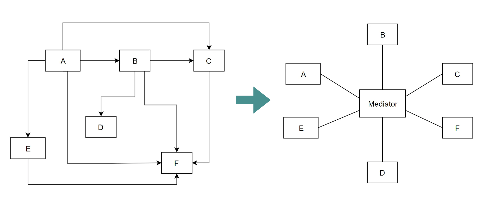

# 信使 Messengers

Messenger 是一个消息传递机制，它可以让对象之间进行通信，而不需要它们之间有直接的引用关系。从设计模式的角度来说，Messenger 其实是中介者模式的一种实现。

可以看出，在使用中介者模式之后，个模块之间不再呈现出网状结构，而是变成了星状结构。这样一来，模块之间的耦合就会大大降低，代码也会变得更加简洁。

!!! info "Messenger 的不同叫法"
    Messenger 在很多 MVVM 框架中均能找到它的身影。虽然叫法不同，但是背后的原理及逻辑都是相通的。这里列举几个常见框架的叫法：

    - CommunityToolkit.Mvvm：Messenger（信使）
    - Prism：EventAggregator（事件聚合）
    - ReactiveUI：MessageBus（消息总线）

## 在有 Messenger 之前

设想一下，平常如果想要实现两个 ViewModel 之间的通信（比如 A 调用 B 的方法，或 A 获取 B 中某个属性的值），我们会采用哪些做法呢？一般来说无外乎下面几种：

1. 想办法将 B 的实例的引用传递给 A，比如将 B 的实例保存为 A 的成员（属性或字段），然后在 A 中调用访问这个成员（引用的传递通常在 A 的构造函数中完成）
2. 在 A 中定义一个事件，然后在 B 中订阅这个事件（这里仍然需要想办法传递引用），当 A 中触发这个事件时，B 中的方法就会被调用
3. 为 B 实现单例模式，然后在 A 中通过 `B.Instance` 来调用 B 的方法或获取 B 的属性值

但是这些方法均存在一个问题：**模块之间存在耦合**。比如，如果我们想要将 B 替换成 C，那么就需要修改 A 的代码；更糟的是，如果我们想让 A 能够与更多的类通信，那么就需要在 A 中添加更多的属性、事件或方法。这样一来，类与类之间的耦合就会越来越严重，代码也会变得越来越难以维护。

## Messenger 背后的原理

Messenger 背后的原理可以想象成一个字典，它的键是消息的类型，值是一个委托列表。在注册时，我们会将类的对象和一个回调函数（委托）作为值添加到字典中；在发送消息时，我们会根据消息的类型从字典中取出对应的委托列表，然后依次调用这些委托。