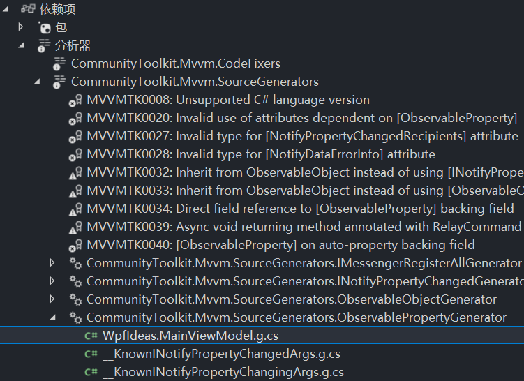

# 适用于字段的特性

## 基本用法

如果希望一个字段拥有一个名称对应的包含通知功能的属性，只需要为字段添加一个 `ObservableProperty` 特性即可。

```csharp
public partial class MainViewModel : ObservableObject
{
    [ObservableProperty]
    private string name = "";
}
```

下面是编译器在后台生成的代码。**这里展示的代码是完整版。后面为了简洁，会省略或简化一些行。**

```csharp
/// <inheritdoc cref="name"/>
[global::System.CodeDom.Compiler.GeneratedCode("CommunityToolkit.Mvvm.SourceGenerators.ObservablePropertyGenerator", "8.2.0.0")]
[global::System.Diagnostics.CodeAnalysis.ExcludeFromCodeCoverage]
public string Name
{
    get => name;
    [global::System.Diagnostics.CodeAnalysis.MemberNotNull("name")]
    set
    {
        if (!global::System.Collections.Generic.EqualityComparer<string>.Default.Equals(name, value))
        {
            OnNameChanging(value);
            OnNameChanging(default, value);
            OnPropertyChanging(global::CommunityToolkit.Mvvm.ComponentModel.__Internals.__KnownINotifyPropertyChangingArgs.Name);
            name = value;
            OnNameChanged(value);
            OnNameChanged(default, value);
            OnPropertyChanged(global::CommunityToolkit.Mvvm.ComponentModel.__Internals.__KnownINotifyPropertyChangedArgs.Name);
        }
    }
}
```

!!! tip
    源生成器可以非常智能地识别字段的名称，并生成相应名称的属性。它支持的命名方式有：

    - 小写字母开头：`firstName`
    - 下划线开头：`_firstName`
    - 其他：`m_firstName`

??? note "如何查看源生成器生成的代码？"
    在 Visual Studio 中，可以在项目的 `依赖项|分析器|CommunityToolkit.Mvvm.SourceGenerators` 中找到生成的代码。也可以在实际代码中使用生成的属性（如上例会生成名为 `Name` 的属性），然后使用 `F12` 键跳转到定义处查看。

    

## 希望额外通知另一个属性

如果希望在字段的值发生变化时，额外通知另一个属性，可以使用 `NotifyPropertyChangedFor` 特性。

```csharp
public partial class MainViewModel : ObservableObject
{
    [ObservableProperty]
    [NotifyPropertyChangedFor(nameof(FullName))] // (1)!
    private string firstName = ""; // (2)!

    public string FullName => firstName + " " + lastName;
}
```

1. 支持传入多个属性的名称
2. `setter` 中会生成形如 `OnPropertyChanged("FullName")` 的代码

!!! info
    工具包并没有类似 `PropertyChanged.Fody` 那样的 `DependsOn` 特性，从而反向标记这个属性会被哪些属性通知

## 通知中继指令更新其可用状态

如果某个中级指令（RelayCommand）的 `CanExecute` 与属性有关，并且希望属性的值发生变化后能够通知中继指令更新状态，那么可以使用 `NotifyCanExecuteChangedFor` 特性：

```csharp
public partial class MainViewModel : ObservableObject
{
    [ObservableProperty]
    [NotifyCanExecuteChangedFor(nameof(FooCommand))] // (1)!
    private bool isFooEnabled; // (2)!

    public IRelayCommand FooCommand { get; }
}
```

1. 支持传入多个中继指令的名称
2. 会在 `setter` 中添加 `FooCommand.NotifyCanExecuteChanged();`

!!! warning
    注意这里传入的是 `Command` 的名称，而不是标记了 `RelayCommand` 特性的方法的名称。

## 广播属性值的变化

如果希望在一个 `ObservableRecipient` 对象中广播广播属性值的变化（即调用 `Broadcast` 方法），可以为字段添加 `NotifyPropertyChangedRecipients` 特性：

```csharp
public partial class MainViewModel : ObservableRecipient
{
    [ObservableProperty]
    [NotifyPropertyChangedRecipients]
    private string name = ""; // (1)!
}
```

1. 会在 `setter` 中添加形如 `Broadcast(oldValue, value, "FirstName")` 的代码

!!! info
    如果希望使用特定的消息频道（token）进行通知，可以参考 [相关章节](../ComponentModel/ObservableRecipient.md#messenger) 中的介绍。

## 验证属性的值是否有效

如果希望在一个 `ObservableValidator` 对象中验证属性的值是否有效，可以为字段添加 `NotifyDataErrorInfo` 特性：

```csharp
public partial class SignUpViewModel : ObservableValidator
{
    [Required]
    [EmailAddress]
    [ObservableProperty]
    [NotifyDataErrorInfo]
    private string email = ""; // (1)!
}
```

1. 会在 `setter` 中添加 `ValidateProperty(value, "Email")` 的代码

!!! note
    如果想要使用这个特性，需要满足以下几点要求：

    1. 当前类必须继承自 `ObservableValidator`
    2. 字段必须包含与验证相关的特性，如 `Required`、`EmailAddress` 等

关于 `ObservableValidator` 类的使用，详见 [相关章节](../ComponentModel/ObservableValidator.md)。

## 为生成的属性添加特性

如果希望为生成的属性添加额外的特性，尤其比如 `JsonIgnore` 等，从而在序列化时忽略这个属性，可以使用下面这个特殊语法：

```csharp
public partial class MainViewModel : ObservableObject
{
    [ObservableProperty]
    [property: JsonIgnore]
    private string name = "";
}
```

这样的话，生成的属性就会包含 `property:` 后面的特性。

## 希望在属性值发生变化后执行额外的逻辑

如果希望在属性值发生变化后执行额外的逻辑，还可以借助分部方法来实现。从 [基本用法](#基本用法) 的中给出的后台生成的完整代码中可以发现，`setter` 中存在一些分部方法，名称为 `On<PropertyName>Changed。借助这些分部方法，我们就可以实现这个需求。形如：

```csharp
public partial class MainViewModel : ObservableObject
{
    [ObservableProperty]
    private string name = "";

    partial void OnNameChanged(string value)
    {
        // Do something
    }

    partial void OnNameChanged(string oldValue, string newValue)
    {
        // Do something
    }
}
```

另外，如果有需要，还可以实现 `OnNameChanging` 分部方法，从而实现在属性值发生变化前执行额外的逻辑。

!!! note
    分部方法的特点是，如果没有给出实现，那么在编译后它们的声明以及调用都会被删除（也因此，它们必须是无返回值的）。所以虽然 `setter` 中可以看到很多分部方法，但是如果不给出实现，它们都会被删除，不会对性能产生影响。

工具包在比较新的版本中为我们提供了可以传入旧值新值的分部方法，它最典型的使用场景是，我们希望在这个属性发生改变后执行一些资源释放相关的逻辑，从而保证旧值可以被 GC 回收。比如：

```csharp
public partial class MainViewModel : ObservableObject
{
    [ObservableProperty]
    private SubViewModel selectedItem;

    partial void OnSelectedItemChanged(SubViewModel oldValue, SubViewModel newValue)
    {
        // 这里可以对旧值执行一些逻辑，常见的比如：
        oldValue?.PropertyChanged -= OnSelectedItemPropertyChanged;
        oldValue?.Dispose();

        // 然后可以对新值执行一些逻辑，比如：
        newValue?.PropertyChanged += OnSelectedItemPropertyChanged;
    }
}
```